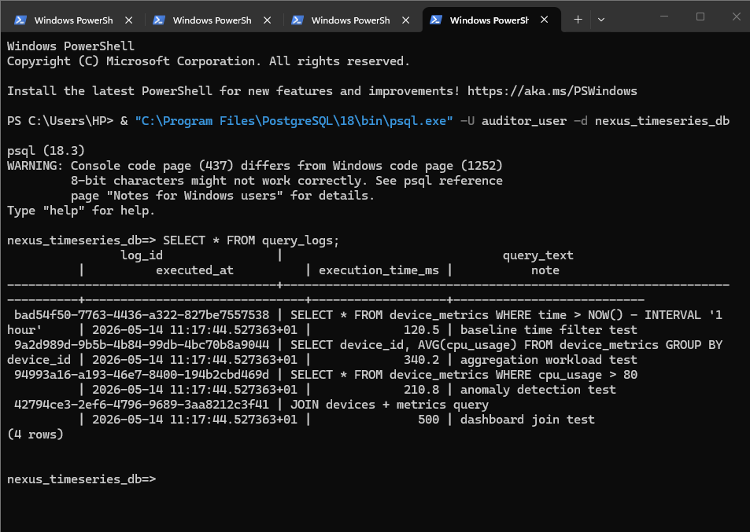
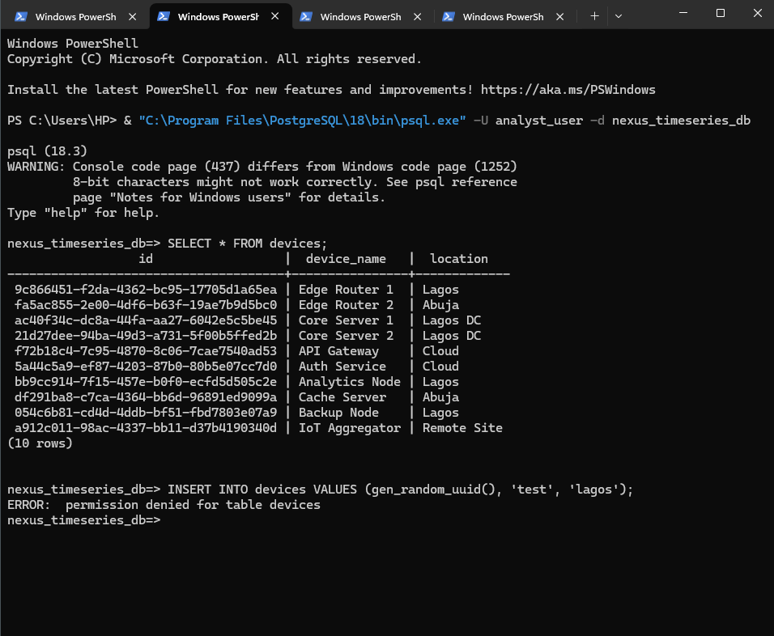
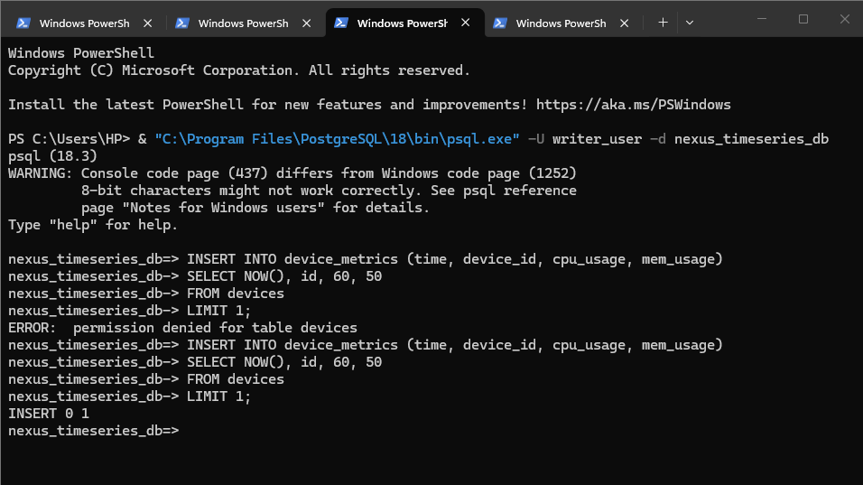

# NexusOps: Secure Time-Series Monitoring System

## Overview

NexusOps is a PostgreSQL-based time-series monitoring system designed to simulate real-world infrastructure telemetry, security management, and database performance optimization.

It models devices generating continuous CPU and memory metrics over time while implementing:

* Role-Based Access Control (RBAC)
* Query logging and monitoring
* Performance analysis using `EXPLAIN ANALYZE`
* Index-based query optimization
* Multi-user database access simulation

The goal is to demonstrate practical database engineering concepts with a focus on security, observability, and performance at scale.

---

# Project Objectives

The system is built around three core operational goals:

1. Secure the database using role-based access control (RBAC)
2. Monitor system activity through query logging and telemetry data
3. Improve query performance using indexing and execution analysis

---

# Tech Stack

* PostgreSQL 18
* pgAdmin 4
* PowerShell
* SQL

---

# Database Architecture

## devices

Stores infrastructure nodes in the system.

| Column      | Description                     |
| ----------- | ------------------------------- |
| id          | Unique device identifier (UUID) |
| device_name | Name of the device              |
| location    | Device location                 |

---

## device_metrics

Stores time-series telemetry data.

| Column    | Description                |
| --------- | -------------------------- |
| time      | Timestamp of metric record |
| device_id | Linked device identifier   |
| cpu_usage | Simulated CPU usage        |
| mem_usage | Simulated memory usage     |

---

## query_logs

Stores query monitoring and audit data.

| Column            | Description           |
| ----------------- | --------------------- |
| log_id            | Unique log identifier |
| query_text        | Executed SQL query    |
| executed_at       | Execution timestamp   |
| execution_time_ms | Query duration        |
| note              | Additional metadata   |

---

# Security Implementation

The system uses Role-Based Access Control (RBAC) to enforce least-privilege access.

## Roles

| Role          | Responsibility           |
| ------------- | ------------------------ |
| nexus_admin   | Full database control    |
| nexus_analyst | Read-only access         |
| nexus_writer  | Insert-only operations   |
| nexus_auditor | Log monitoring & updates |

---

# Monitoring & Observability

The system simulates production-style monitoring by:

* Tracking device telemetry over time
* Logging SQL query execution activity
* Identifying high CPU and memory usage patterns
* Supporting execution plan analysis

---

# Performance Optimization

Query performance was evaluated using:

* `EXPLAIN ANALYZE` for execution tracing
* Large-scale synthetic datasets
* Time-based query filtering

Indexes were introduced to improve query efficiency.

## Implemented Indexes

| Index                        | Purpose                      |
| ---------------------------- | ---------------------------- |
| idx_device_metrics_time      | Optimizes time-range queries |
| idx_device_metrics_device_id | Optimizes joins & lookups    |

---

# PostgreSQL Concepts Used

| Feature           | Purpose                       |
| ----------------- | ----------------------------- |
| pgcrypto          | UUID generation               |
| generate_series() | Time-series data simulation   |
| random()          | Synthetic workload generation |
| EXPLAIN ANALYZE   | Query performance analysis    |
| CREATE INDEX      | Performance optimization      |
| GRANT             | Access control management     |

---

# Sample Query Workloads

## Time-based filtering

```sql
SELECT *
FROM device_metrics
WHERE time > NOW() - INTERVAL '1 hour';
```

---

## Aggregation

```sql
SELECT device_id, AVG(cpu_usage)
FROM device_metrics
GROUP BY device_id;
```

---

## Anomaly Detection

```sql
SELECT *
FROM device_metrics
WHERE cpu_usage > 80;
```

---

# Learning Outcomes

This project demonstrates:

* Time-series database design
* PostgreSQL security architecture
* Query optimization strategies
* Observability and logging systems
* Multi-user database simulation

---

# Future Improvements

* Automated audit triggers
* Table partitioning for scalability
* Backup and recovery workflows
* Dashboard visualization layer
* API integration using FastAPI

---

# Project Structure

```text
Nexus_ops_timeseries/
├── Nexus_ops_timeseries.sql
├── README.md
└── images/
    ├── admin_login.png
    ├── analyst_select.png
    ├── writer_insert.png
    └── auditors_logs.png
```

---

# UML Relationship Diagram

```text
devices (1) ─────── (many) device_metrics

devices
  id (PK)
  device_name
  location

device_metrics
  time
  device_id (FK)
  cpu_usage
  mem_usage

query_logs
  log_id (PK)
  query_text
  executed_at
  execution_time_ms
  note
```

---

# PowerShell Access Testing

The system simulates multi-user database access using PostgreSQL roles and PowerShell authentication testing.

---

## Admin Access

```powershell
psql -U admin_user -d nexus_timeseries_db
```

Full administrative access validation.



---

## Analyst Access

```powershell
psql -U analyst_user -d nexus_timeseries_db
```

The analyst role is limited to read-only operations.

Successful SELECT query:

```sql
SELECT * FROM devices;
```



Blocked INSERT operation:

```sql
INSERT INTO devices VALUES (gen_random_uuid(), 'Test Device', 'Lagos');
```


This demonstrates RBAC privilege enforcement through restricted write access.

---

## Writer Access

```powershell
psql -U writer_user -d nexus_timeseries_db
```

The writer role can insert operational telemetry data.

```sql
INSERT INTO device_metrics (time, device_id, cpu_usage, mem_usage)
SELECT NOW(), id, 50, 40
FROM devices
LIMIT 1;
```



This validates controlled ingestion permissions within the telemetry pipeline.

---

## Auditor Access

```powershell
psql -U auditor_user -d nexus_timeseries_db
```

The auditor role is responsible for monitoring and managing query logs.

```sql
SELECT * FROM query_logs;
```


This demonstrates observability and audit-level database access.

---

# Final Summary

NexusOps simulates a secure and optimized PostgreSQL-based monitoring system for time-series telemetry.

The project demonstrates:

* Structured database design
* Role-based security enforcement
* Observability through query logging
* Performance optimization via indexing
* Realistic multi-user database behavior
* Practical PostgreSQL administration workflows

The system reflects foundational backend database engineering concepts commonly used in production monitoring environments.
